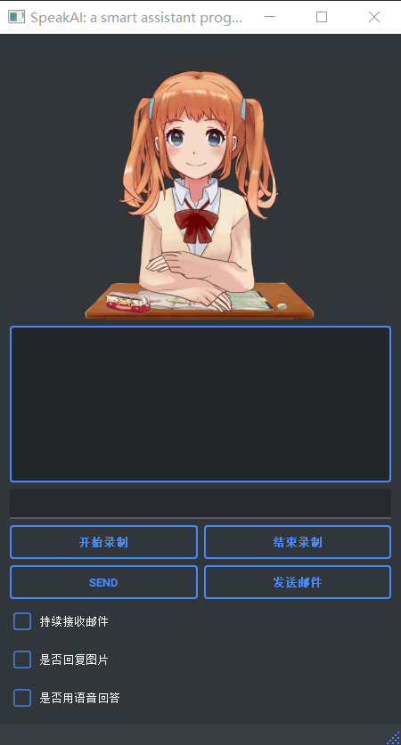
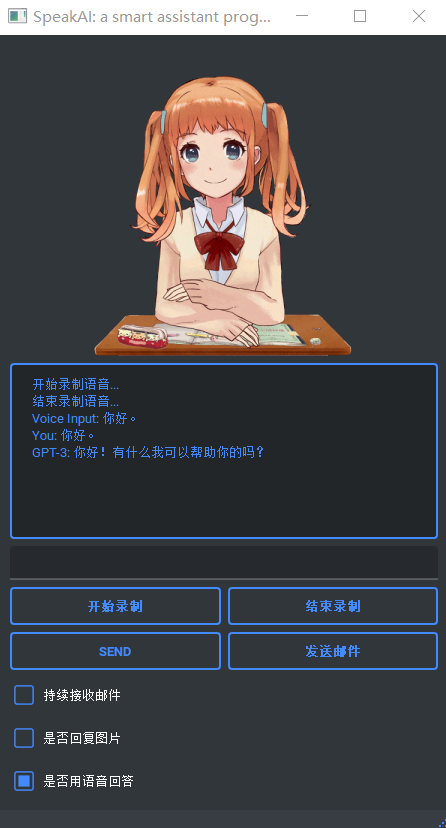
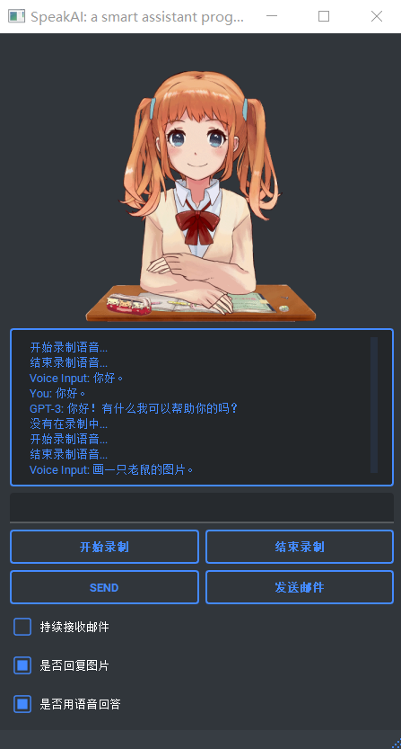
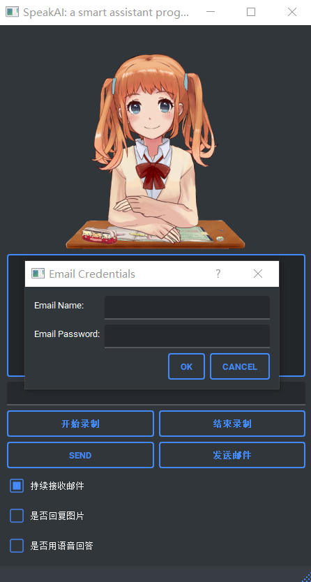

#  SpeakAI: a smart assistant program

2050633 Lu Jialin

2050605 Yan Wenhao

2051475 Wang Hao

## Brief Description

### 1. Introduction

This project is a powerful intelligent assistant program designed to provide users with voice and text interaction capabilities. The program adopts a modular structure, including the User Interface Module, Speech Recognition Module, Intelligent Q&A Module, Voice Dialogue Module, Image Generation Module, and Email Processing Module, offering users a comprehensive interactive experience and practical functionality.

### 2. Structures and Modules

The **User Interface Module** serves as the interface for user interaction with the assistant, featuring user-friendly design and various input options. Users can conveniently communicate by entering text in the text input box, while the voice input function allows direct communication through speech. Menu options provide quick access to various features.

The **Speech Recognition Module** is the key component for enabling speech interaction. By clicking the "Start Recording" button, users initiate speech recording, and when they click the "Stop Recording" button, the Speech Recognition Module ceases recording and converts the user's speech into text. This process is accomplished by utilizing the Baidu Speech Recognition API, ensuring high-quality speech-to-text functionality.

The **Intelligent Q&A Module** forms the core of the entire program. It receives user input in the form of speech or text and sends it to the GPT-3 model for processing. The GPT-3 model, an advanced natural language processing model, understands the user's questions or requests and generates accurate and logical responses. The Intelligent Q&A Module displays the replies generated by the GPT-3 model in the text box for the user to view, providing intelligent question-answering functionality.

The **Voice Dialogue Module** offers users a flexible interaction method. By default, the assistant interacts with the user in text format, displaying replies in the text box. However, users also have the option to engage in voice conversations. Leveraging the Baidu AI Open Platform's Python SDK for speech recognition services, the Voice Dialogue Module converts the responses generated by the GPT-3 model into speech and plays them back to the user via the speaker, enabling a natural and fluent voice dialogue experience.

The **Image Generation Module** is a powerful component responsible for generating corresponding image responses based on user requests. The module accepts text or voice input from the user and passes it to relevant image processing algorithms or services to generate the desired image results. The Image Generation Module can be applied in various scenarios, such as converting text descriptions into images or performing image synthesis, providing users with diverse and rich image processing capabilities.

The **Email Processing Module** equips the assistant with email handling capabilities. It can check the user's mailbox and populate the email contents into the text box for easy viewing. Additionally, users can click the "Send Email" button to send the GPT-3 model's replies as email content to specified recipients, facilitating convenient email processing functionality.

### 3. Summary

In summary, this intelligent assistant program combines a variety of interactive methods and multifunctional modules to deliver highly convenient and intelligent services to users. Through features such as speech recognition, intelligent Q&A, voice dialogue, image generation, and email processing, users can interact with the assistant in multiple ways and receive personalized and accurate responses and services. This project significantly enhances user experience and caters to specific user requirements in different scenarios.

## Implemented Requirements

The implemented requirements aim to cater to users' needs for convenience, intelligent assistance, natural dialogue, and advanced image processing capabilities. The program incorporates user-friendly elements in various modules, ensuring a seamless and interactive experience for users across different domains and scenarios.

### 1. Target Users:

The intelligent assistant program is designed to cater to a wide range of users, including individuals, professionals, and businesses. It aims to provide assistance and support in various domains, such as information retrieval, task automation, communication, and image processing. The program is suitable for users who seek efficient and intelligent solutions to their queries, require convenient communication methods, and desire advanced functionality for image-related tasks.

### 2. Specific User Requirements:

**Convenient Interaction**: Users expect a user-friendly interface that allows seamless interaction with the assistant. They desire the flexibility to choose between text and voice input methods based on their preferences and convenience.

**Accurate Speech Recognition**: Users rely on accurate speech recognition to ensure their voice inputs are correctly transcribed into text. They expect the program to effectively capture their speech and convert it into accurate textual representation.

**Intelligent Question-Answering**: Users look for an intelligent assistant that can understand their questions or requests and provide accurate and relevant answers. They expect the program to utilize the powerful GPT-3 model to generate intelligent responses that address their queries comprehensively.

**Natural Voice Dialogue**: Users seek a natural and fluent voice dialogue experience. They want the option to engage in voice conversations with the assistant and hear the responses in a clear and understandable manner.

**Image Processing Capabilities**: Users require the program to handle image-related tasks, such as generating images based on text descriptions or performing advanced image synthesis. They expect the program to provide accurate and visually appealing image results.

### 3. Implemented Functionality:

The intelligent assistant program implements the following key functionalities to meet user requirements:

**User-friendly Interface**: The User Interface Module offers a visually appealing and intuitive interface, including text input boxes, voice input functionality, and menu options. This allows users to interact with the assistant conveniently and select their preferred mode of communication.

**Speech Recognition**: The Speech Recognition Module records and transcribes user speech into text using the Baidu Speech Recognition API. This ensures accurate conversion of spoken input and enables seamless integration of voice interaction.

**Intelligent Q&A**: The Intelligent Q&A Module leverages the power of the GPT-3 model to process user questions or requests and generate intelligent and relevant responses. The module displays the generated replies in the text box for users to review and access valuable information.

**Voice Dialogue**: The Voice Dialogue Module provides users with the option to engage in voice conversations with the assistant. It converts the responses generated by the GPT-3 model into speech using the Baidu AI Open Platform's Python SDK, enabling a natural and interactive voice dialogue experience.

**Image Generation**: The Image Generation Module accepts user input in the form of text or voice and utilizes advanced image processing algorithms or services to generate corresponding image results. This functionality enables users to transform textual descriptions into visual representations and perform various image-related tasks.

This is the result:

**Email Processing Module**: The Email Processing Module allows users to manage their email communication seamlessly. It enables the program to check for new emails and conveniently display the contents in the text box for users to review. Additionally, users can leverage the functionality to compose and send emails, with the generated responses from the GPT-3 model serving as the email content. This module enhances user interaction by integrating email communication within the intelligent assistant program.

### 4. User Interaction and User-Friendly Elements:

Several components of the program demonstrate user interaction and user-friendly elements:

**User Interface Module**: The visually appealing interface, text input boxes, and menu options enhance user interaction and ease of use. Users are greeted with an aesthetically pleasing interface that captures their attention and encourages engagement. The text input boxes provide a convenient way for users to input their queries or requests, while the menu options offer easy navigation and access to different functionalities. Together, these elements create a user-friendly interface that promotes a seamless and enjoyable user experience.

**Voice Dialogue Module**: By offering voice interaction and playing back responses, the module provides users with a natural and intuitive conversational experience. Users can engage in voice conversations with the assistant, allowing for hands-free and convenient communication. The module accurately captures and transcribes user speech, enabling effective communication between the user and the assistant. The playback of responses in a clear and understandable manner enhances the overall user-friendliness of the program.

**Intelligent Q&A Module**: The display of responses in the text box allows users to review and understand the assistant's generated answers easily. Users can conveniently read and analyze the responses provided by the assistant in a visually organized manner. The module utilizes the powerful GPT-3 model to generate intelligent and relevant answers, addressing user queries comprehensively. The clear presentation of responses enhances user interaction and facilitates effective communication with the assistant.

**Image Generation Module**: Users can input text or voice requests and receive visually appealing image responses, providing a user-friendly way to interact with image-related tasks. The module leverages advanced image processing algorithms or services to generate accurate and visually appealing images based on user input. Users can describe an image using text or voice, and the module transforms these descriptions into vibrant visual representations. This functionality offers a user-friendly and intuitive approach to engage with image-related tasks.

**Email Processing Module**: The Email Processing Module adds another dimension of user interaction and convenience by integrating email handling capabilities. Users can connect their email accounts to the assistant and utilize features such as email composition, inbox management, and email search. The module allows users to conveniently send and receive emails within the program, eliminating the need to switch between multiple applications or interfaces. It provides a user-friendly interface for managing email-related tasks and ensures seamless communication within the assistant's ecosystem.

## Advantages and Disadvantages

### 1. Advantages

The program offers a **conversational feature** that enables users to interact and receive responses from the intelligent assistant. This conversational feature serves as the heart of the program, fostering seamless interaction between users and the intelligent assistant. Users can engage in natural, free-flowing conversations, asking questions, seeking guidance, or simply engaging in casual chat. The assistant, powered by advanced natural language processing algorithms, comprehends user input accurately and provides prompt and relevant responses. This interactive capability creates a personalized and engaging experience, making the program feel like a knowledgeable and attentive conversation partner.

The program supports **voice recording and voice-based responses**, allowing users to communicate using their voice and enhancing flexibility and convenience. By incorporating voice recording and voice-based responses, the program takes user interaction to a whole new level of convenience and flexibility. Users can simply speak their queries or instructions, eliminating the need for manual typing. This hands-free approach enables users to communicate effortlessly, especially in situations where manual input may be inconvenient or not possible, such as when multitasking or when using the program on mobile devices. The program's advanced voice recognition technology accurately transcribes user speech into text, and the intelligent assistant responds with clear and articulate voice-based answers, replicating a natural conversation and enhancing the user experience.

In addition to its conversational capabilities, the program goes beyond being a mere assistant by integrating **email functionality**. Users can conveniently access their email accounts directly within the application, eliminating the need to switch between multiple platforms or applications. This streamlined approach saves time and effort, allowing users to compose, send and receive their emails seamlessly. This integration empowers users to stay productive and connected without leaving the program, providing a comprehensive and efficient platform for managing their email communications.

The program features a **clean and intuitive user interface**, ensuring user-friendliness and ease of operation. The program's user interface is meticulously designed to prioritize user-friendliness and ease of operation. With its clean and intuitive layout, users can quickly navigate through different features and functionalities without confusion or complexity. The interface employs visually appealing elements, including clear icons, well-organized menus, and intuitive controls, ensuring that users can easily access the desired functions and interact with the program effortlessly. This intuitive user interface reduces the learning curve for new users and enhances the overall usability of the program, allowing users to fully enjoy its rich features and capabilities from the moment they start using it.

### 2. Disadvantages

The program relies on the GPT-3 model, Baidu speech recognition, and Baidu AI speech synthesis interfaces, which **requires a stable internet connection** for optimal performance. This dependency on external services may introduce potential issues related to network connectivity and reliability. For example, if the internet connection is unstable or disrupted, it may result in delays or interruptions in the program's functionality. Additionally, relying on external services means that any changes or limitations in those services could directly impact the program's performance and availability.

Although the program currently supports conversations in English and Chinese, it has **limited support for other languages**. This limitation may restrict the accessibility and usability of the program for users who prefer to interact in languages other than English and Chinese. For users who speak languages not supported by the program, they may face difficulties in effectively communicating with the intelligent assistant and obtaining accurate responses. This language limitation may limit the program's reach and user base, especially in multicultural and multilingual environments where diverse language support is crucial.

The **accuracy of voice recording and conversion** in the program can be influenced by various factors, such as environmental noise, microphone quality, and speech patterns. In real-world scenarios, ambient noise or background sounds can interfere with the clarity of the recorded voice, leading to potential inaccuracies or misunderstandings in the assistant's interpretation. Additionally, the performance of the speech recognition and synthesis technology may vary depending on the quality of the microphone used by the user. Low-quality microphones may result in distorted or unclear voice inputs, affecting the accuracy of the program's responses. It's important for users to be aware of these limitations and ensure they are in a suitable environment for voice interactions to achieve the best possible results.

## How to Improve

### 1. Enhance Language Support:

Expand language support beyond English and Chinese to cater to a wider user base. Incorporate additional language models or translation services to enable conversations in multiple languages.

Implement language detection capabilities to automatically identify the language used by the user and provide appropriate responses.

### 2. Offline Functionality:

Reduce the program's dependency on an internet connection by implementing offline functionality. This would allow users to use essential features even when they don't have internet access.

Explore local language processing capabilities by integrating offline language models or libraries to improve response time and ensure a seamless user experience.

### 3. Noise Reduction and Speech Enhancement:

Develop algorithms or integrate third-party libraries that can effectively reduce background noise during voice recording and enhance speech quality.

Implement noise cancellation techniques to improve the accuracy of voice recognition and transcription, even in noisy environments.

### 4. User Feedback and Iterative Updates:

Incorporate a feedback mechanism within the program to gather user suggestions and identify areas for improvement.

Regularly update and enhance the program based on user feedback, addressing bugs, adding new features, and refining existing functionalities.

### 5. Security and Privacy:

Prioritize data security and privacy by implementing encryption protocols and secure communication channels for sensitive user information, such as emails.

Clearly communicate the program's data handling practices and obtain user consent for data collection and usage to build trust and ensure compliance with privacy regulations.

### 6. Documentation and User Support:

Provide comprehensive documentation and user guides to assist users in navigating the program's features and functionalities.

Establish a dedicated support channel or community forum to address user queries, troubleshoot issues, and gather user insights for ongoing program improvement.

## Contribution of Each Member

| Student Number | Name       | Score Weight |
| -------------- | ---------- | ------------ |
| 2050633        | Lu Jialin  | 100%         |
| 2050605        | Yan Wenhao | 100%         |
| 2051475        | Wang Hao   | 100%         |

### Lu Jialin 2050633: 

Lu Jialin played a key role in the project as the main backend developer. He was responsible for designing and implementing the backend functionality of the system. Lu Jialin leveraged his expertise in programming languages and frameworks to build the core components, handle data processing, and ensure the smooth operation of the system. His contributions were instrumental in creating a robust and efficient backend that supported the program's key features.

### Yan Wenhao 2050605: 

Yan Wenhao made significant contributions to the project as the main frontend developer. His primary focus was on designing and implementing the user interface and frontend functionality. Yan Wenhao utilized his creativity and knowledge of frontend technologies to create an engaging and user-friendly interface. He implemented interactive features, optimized the user experience, and ensured seamless integration with the backend. Yan Wenhao's contributions were crucial in delivering a visually appealing and intuitive frontend for the program.

### Wang Hao 2051475: 

Wang Hao's contributions to the project primarily revolved around documentation and frontend interface adjustments. He took charge of preparing the project report document, ensuring its clarity, accuracy, and coherence. Wang Hao demonstrated excellent technical writing skills to effectively articulate the project's goals, methodology, and outcomes. Additionally, they provided recommendations for improving the frontend interface, making necessary modifications to enhance its usability and aesthetics.
