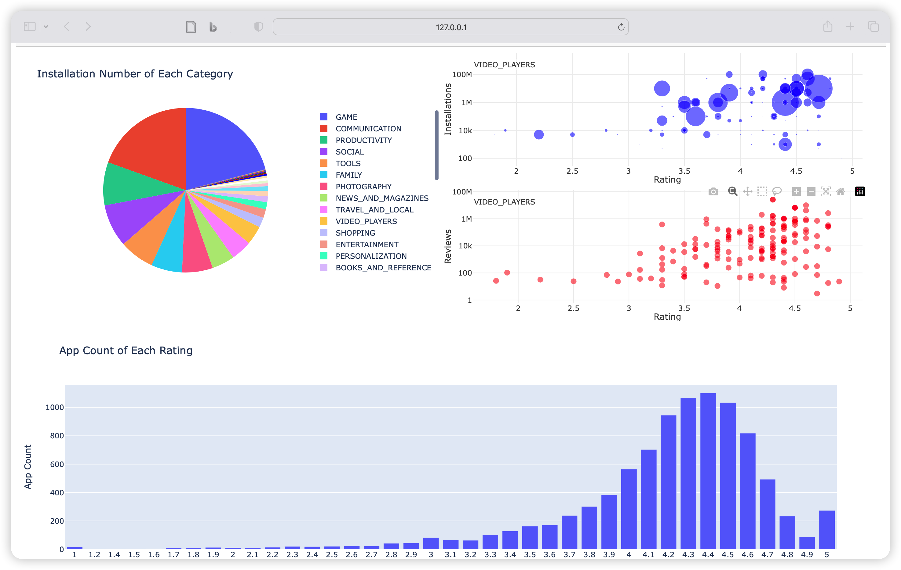
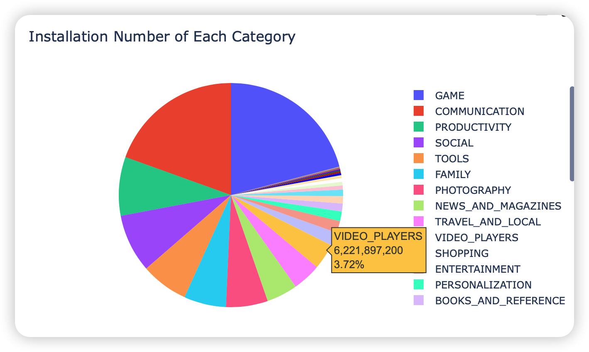
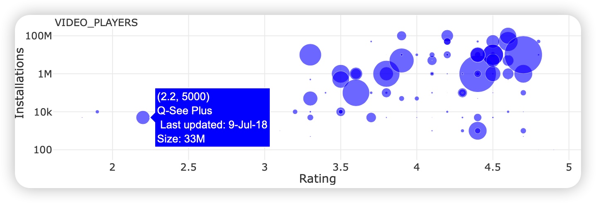
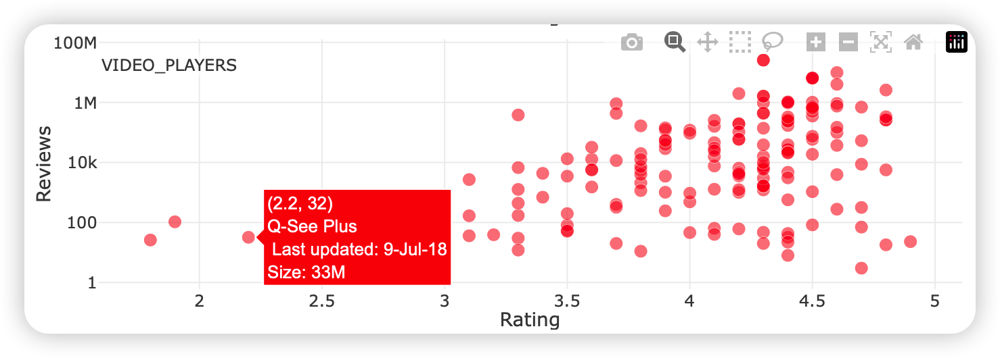
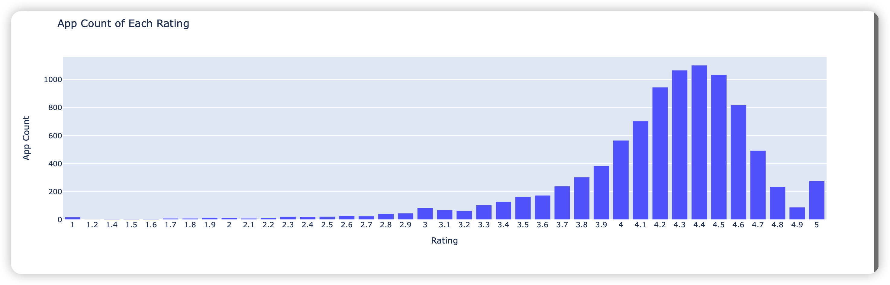

## 1. Project Structure

```
├── report.pdf
├── img
├── lab4.py             # source code
├── googleplaystore.csv # data
└── README.md
```


## 2. Use

* Install dependencies

```sh
pip install pandas
pip install dash
pip install plotly
```

* Run the command in terminal

```sh
python lab4.py
```

* Visit http://127.0.0.1:8050/ in browser


## 3. Introduction

### 3.1 Overall

The dash board visualizes app-related data of google play store. It is mainly compose by the following 3 parts:

- A pie graph showing installation number of each app category
- Two scatter graphs. One show relationship between installation number and ratings, while the other show relationship between review number and ratings.
- A bar graph showing the app count under each rating.



### 3.2 Pie Graph

The pie graph contains all categories of apps in google play store and visualizes the relative amount of each category.

When mouse hovering any of the categories, the detailed infomation is demonstrated and the scatter graphs on the right switches simultaneously.

As is demonstrated, game and communication are the two categories that dominate.




### 3.3 Installs-Rating Scatter Graph

The upper scatter graph mainly in blue show the relationship between installation number and ratings. When mouse hovering, the scatter points show detailed infomation about itself, such as specific rating, specificinstallation number, categories and size.




### 3.4 Review-Rating Scatter Graph

The lower scatter graph mainly in red is similar as the upper one. It shows  the relationship between review number and ratings. When mouse hovering, similar detailed information appears.




### 3.5 Bar Graph

The bar graph in the bottom of dash board shows app count under each rating. As is demonstrated, almost all of the apps are rated higher than 3.5 and the most common rating is 4.4.


