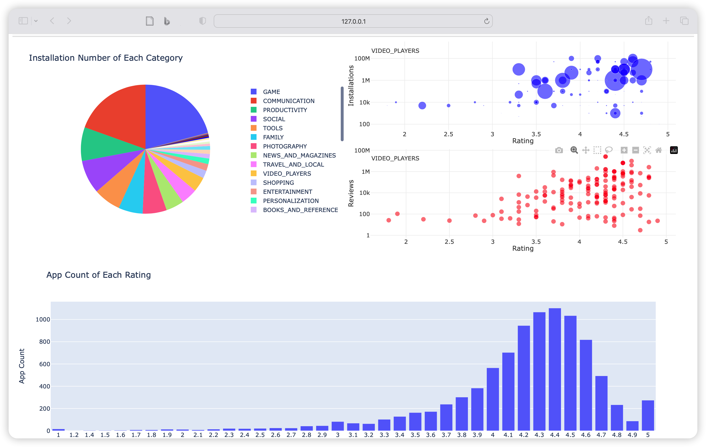
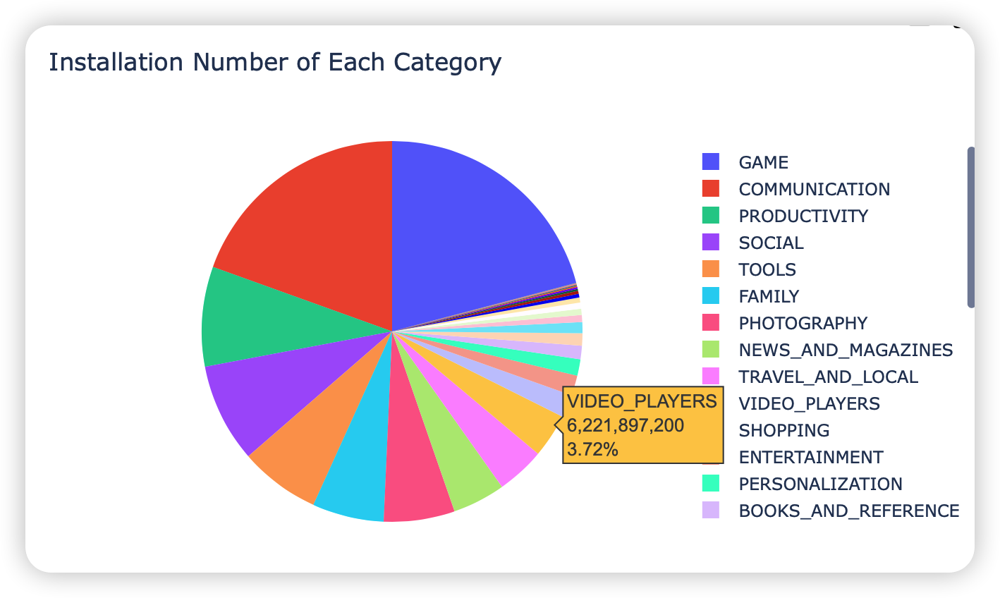
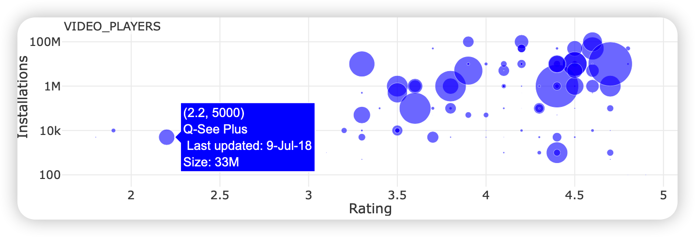
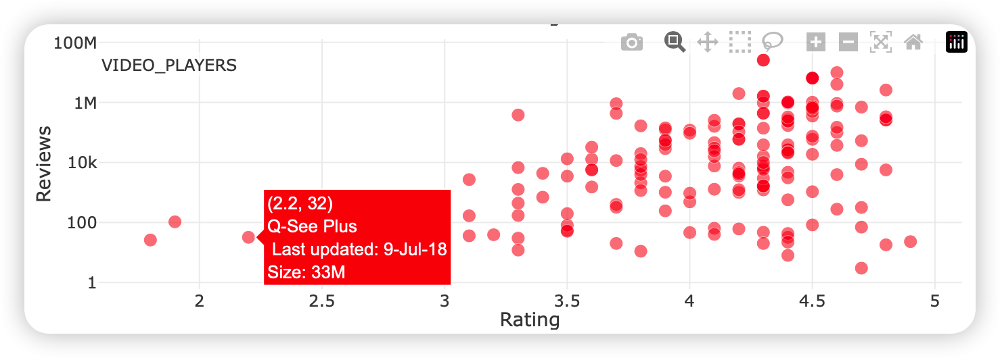
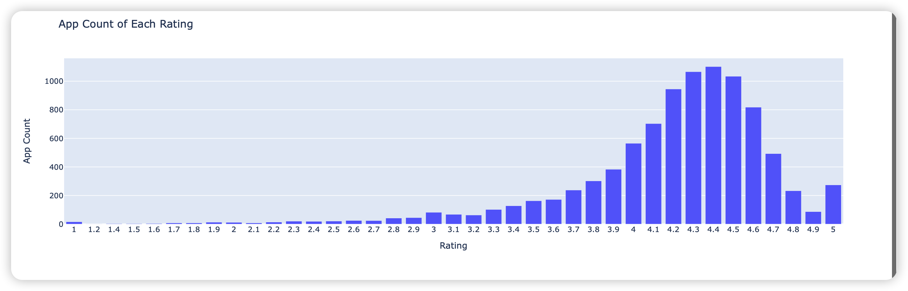

# 1. Data Analysis Task 

### Objectives

The google play store dataset stores a mount of data related with apps that we download and use everyday. By analyzing the dataset, we get to know how people like the numerous apps on app store.

The data analysis objectives of this dash board are demonstrated as follows:

* The total installation number of each categories and their comparison.
* The relationship between the number of installation number and ratings.
* The relationship between the number of review number and ratings.
* How app installations are distributed to each rating and their relative comparison.

### Characteristics of the Dataset

By visualizing the dataset, we can clearly grasp the obvious characteristics of the dataset. Some of them are as follows:

- Game and communication are the two categories that dominate.
- Basically, the larger an app's installation number and review number, the higher its rating might be.
- Almost all of the apps are rated higher than 3.5 and the most common rating is 4.4.

## 2. Design

### 2.1 Overall

The dash board visualizes app-related data of google play store. It is mainly compose by the following 3 parts:

- A pie graph showing installation number of each app category
- Two scatter graphs. One show relationship between installation number and ratings, while the other show relationship between review number and ratings.
- A bar graph showing the app count under each rating.

### 2.2 Pie Graph

The pie graph contains all categories of apps in google play store and visualizes the relative amount of each category.

When mouse hovering any of the categories, the detailed infomation is demonstrated and the scatter graphs on the right switches simultaneously.

As is demonstrated, game and communication are the two categories that dominate.

### 2.3 Installs-Rating Scatter Graph

The upper scatter graph mainly in blue show the relationship between installation number and ratings. When mouse hovering, the scatter points show detailed infomation about itself, such as specific rating, specificinstallation number, categories and size.

### 2.4 Review-Rating Scatter Graph

The lower scatter graph mainly in red is similar as the upper one. It shows  the relationship between review number and ratings. When mouse hovering, similar detailed information appears.

### 2.5 Bar Graph

The bar graph in the bottom of dash board shows app count under each rating. As is demonstrated, almost all of the apps are rated higher than 3.5 and the most common rating is 4.4.

