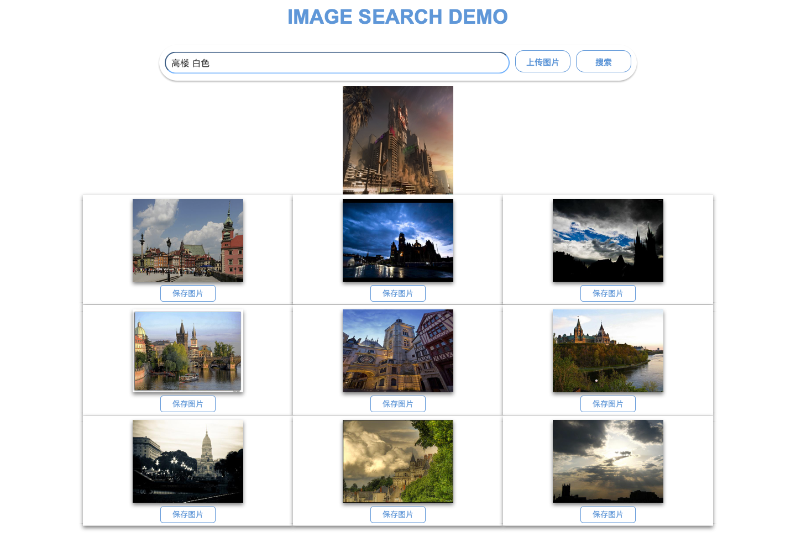
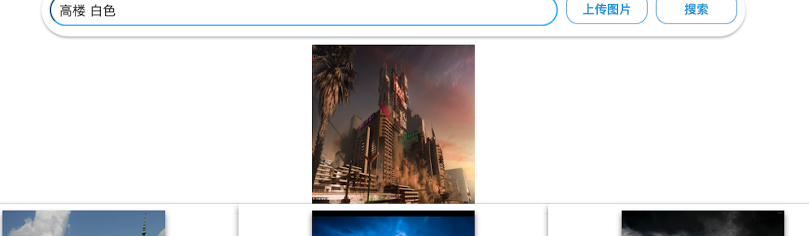
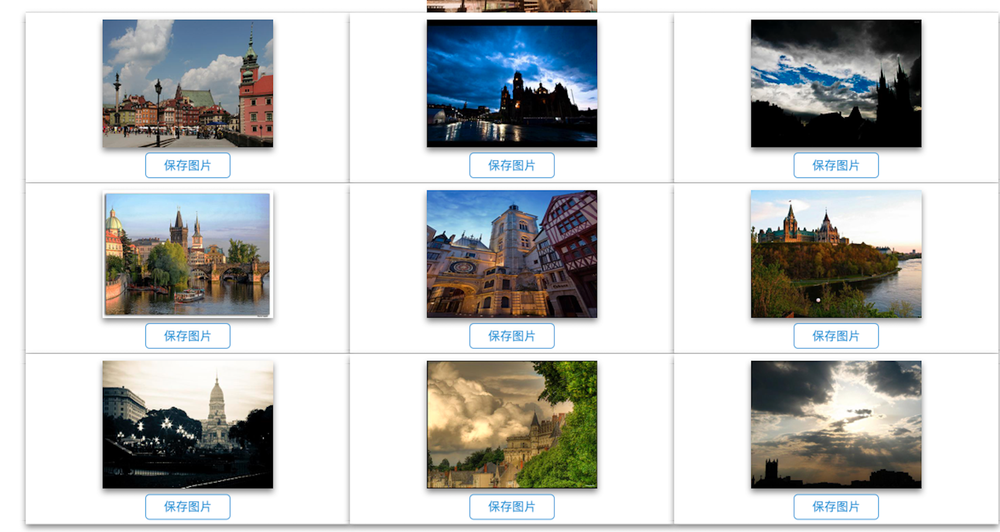

# Lab3 Information Retrieval



## Use

- Download [imagenet](https://drive.google.com/open?id=1UOyZ8166qM3SzxGvaUeWpBzSUfoQLUjJ) folder, extraxt and keep it in server directory

- Download datasets for [footwares](http://vision.cs.utexas.edu/projects/finegrained/utzap50k/), [apparels](http://mmlab.ie.cuhk.edu.hk/projects/DeepFashion/InShopRetrieval.html) keep them inside a directory under upload folder. Final folder strcture will be as below

```
      root folder  
      │
      └───lib
      │   
      └───server
      |   │───rest-server.py
      |   │───imagenet
      |   │───static
      |   │───templates
      |   │───uploads
      |        │────dogs_and_cats
      |              │────shoes
      |              │────sandals
      |              │────slippers
      |              │────boots
      |              │────apparels
```

- To run the code, you should install `conda` environment like the following:

    ```shell
    pip install -r requirements.txt
    ```

    On the other hand, you should also download and unzip [database.zip](https://anjt.oss-cn-shanghai.aliyuncs.com/database.zip) in `server`.

    After installing the essential package, you can run the code as follows:

    ```shell
    cd server
    python image_vectorizer.py

- Start the server as follows:

  ```shell
  python rest_server.py
  ```

  Then you can visit the website: http://127.0.0.1:5000/


## Task Requirements

The requirements of an image search task is as follows:

1. **Formulation**: 
   - It contains an input box to upload an image.
   - Users can preview the query image in the searching window.
2. **Initiation**: It has a search button.
3. **Preview**: Provide an overview of the results.
4. **Refinement**: Allow changing search parameters when reviewing results.
5. **Use**: Users can take some actions, like add selected images to collection.

## Functionality

### Formulation

- Upload the image

  

- Preview the image uploaded

  

  

### Initiation

Click the search button for result:


### Preview:

- The overview of the results:

  

  


### Refinement

Change searching parameters.


### Use:

- Save an image:

  

  

  


