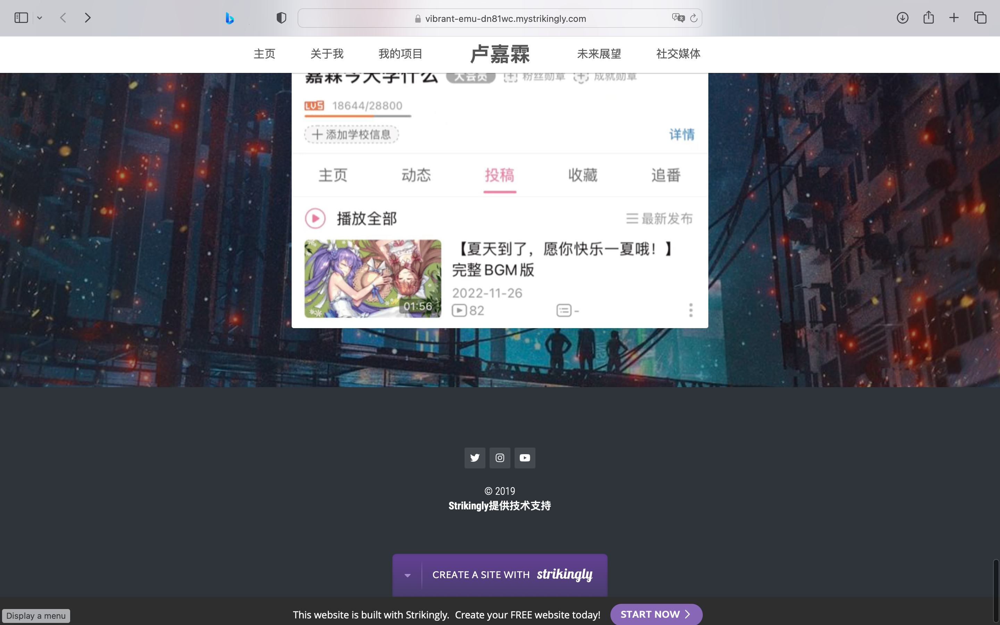

# 用户交互技术第一次作业介绍

**2050633 卢嘉霖**

[主页地址](https://vibrant-emu-dn81wc.mystrikingly.com)（受部署服务器限制，访问需要境外IP）

---

## 1.界面风格

根据我的偏好，本页面界面风格选取为“赛博朋克”风，主要体现在以下几个方面：

- 背景图片：赛博朋克风艺术插画，使用暗色蒙版防止图片过于夺目
- 主色调：以赛博朋克风代表性色彩洋红、青蓝为主，配合黑色和白色，突出科幻感
- 字体：多为粗体白色，在暗色调背景上更醒目和简洁
- 按钮：基本采用纯文字或图片作为按钮或链接，减少按钮UI元素，突出文字内容和简洁风格。

---

## 2.架构设计

- 本页面为个人主页，可展示信息有限，因此采用流式布局，全部内容在单个页面中从上往下依次排列，顶部导航栏提供快速跳转功能。

- 各背景图片之间采用视差滚动效果，使得页面更具动感。

---

## 3.主要内容

主要内容包括：

- 主页：主要空间留给背景高清大图，奠定整个网页赛博朋克风格。顶部为导航栏，右侧为页面主人姓名、所属单位。
- 关于我：包括头像和文字简介。
- 我的项目：纵向依次排列若干项目，包括项目名称、项目简介、项目截图、项目源码。
- 未来展望：横向排列若干项目，展示未来的计划。
- 社交媒体：纵向排列若干社交媒体账号，包括社交媒体名称、主页截图（图片包含链接），包括Twitter、Instagram、GitHub等。

---

## 4.截图展示

#### 主页

#### 自我介绍

#### 项目经历

#### 未来展望

#### 社交媒体账号

#### 页脚

